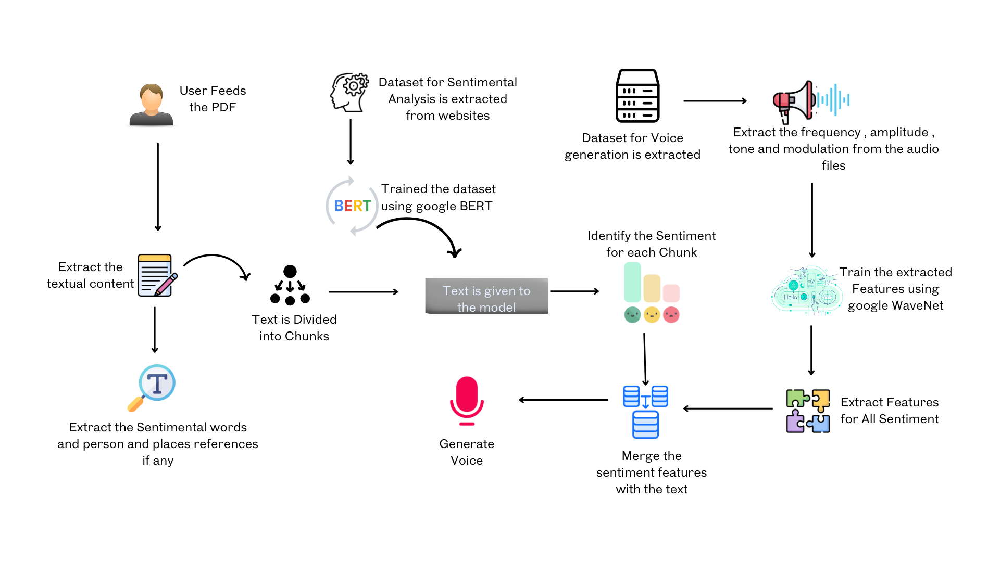

# Dream_PDF 📖

## 🟩 Overview
DreamPDF is a revolutionary app that enhances the reading experience of PDF documents. Users can easily upload PDFs, and the app identifies people, places, and emotional words within the text. These emotions are highlighted and reflected in the voice modulation during narration, making the reading lively and engaging. Combining advanced technology with a user-friendly design, DreamPDF offers a unique, immersive way to read and interact with PDF documents. 

Plus, you can enjoy text summaries and choose from different voice options, like male or female, to suit your preference. ✨


## 🟩 Workflow


## 🟩 Tech Stack 💻

### Frontend
- **Web Application**: React.js
- **Mobile Application**: Flutter

### Backend :
- **Node.js and Express**

### Database
- **MongoDB**


## 🟩 Getting Started 

### Prerequisites
- Node.js: [Download and install Node.js](https://nodejs.org/)
- React.js: Setup using `create-react-app`
- Flutter: [Installation guide](https://flutter.dev/docs/get-started/install)
- MongoDB: [Installation instructions](https://www.mongodb.com/try/download/community)

### Installation
1. Clone the Repository
   ```bash
   git clone https://github.com/linga-007/Dream_PDF.git
   cd Dream_PDF


## 🟩 Output Screens


